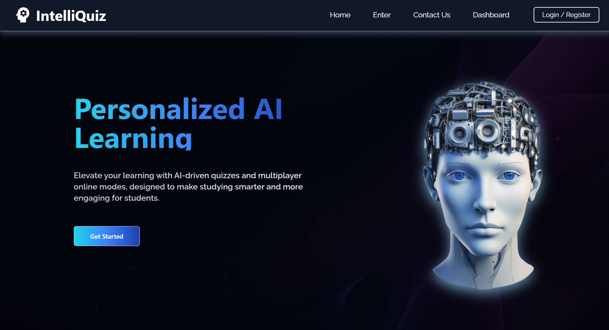
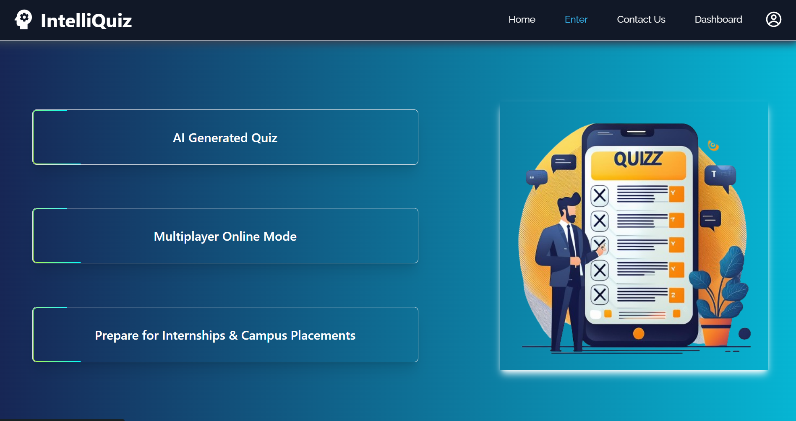
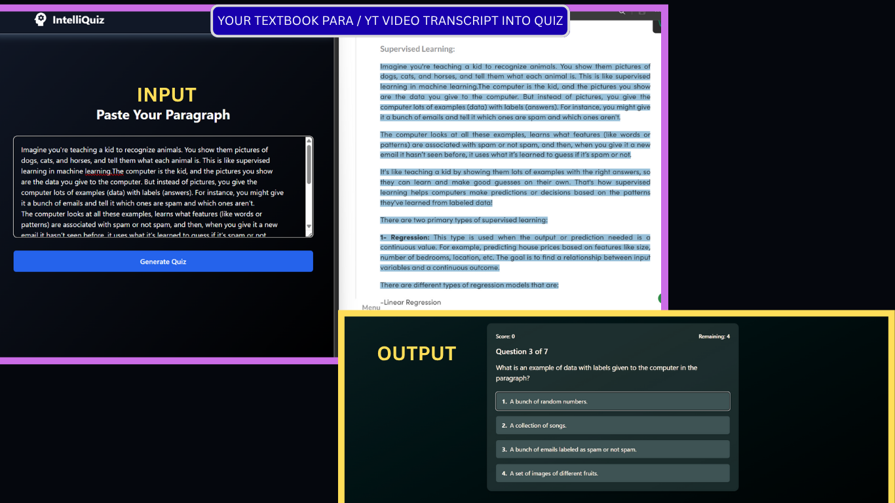
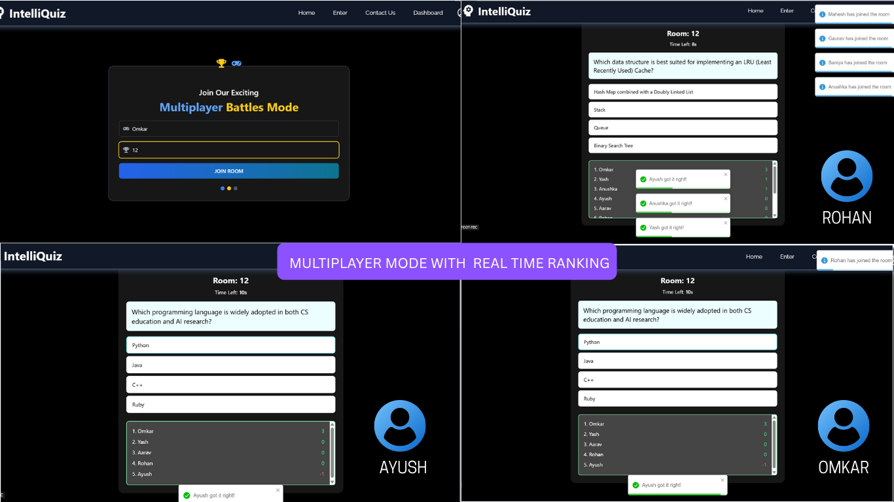
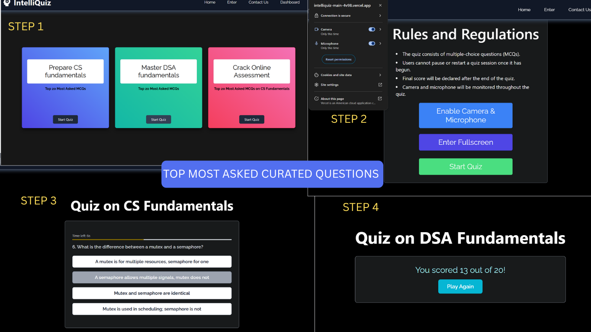

# IntelliQuiz
### Elevate your learning with AI-driven quizzes and multiplayer online modes, designed to make studying smarter and more engaging for students.

[](https://intelliquiz-main-4v98.vercel.app)  


### FEATURES 


### YOUR TEXT PARA TO MCQ 


### PLAY MULTIPLAYER ONLINE MODE WITH FRIENDS 


### ONLINE ASSESSEMENTS TEST 

---

## Table of Contents
1. [Overview](#overview)  
2. [Features](#features)  
3. [Technology Stack](#technology-stack)  
4. [Architecture & Project Structure](#architecture--project-structure)  
5. [Installation & Setup](#installation--setup)  
6. [Environment Variables](#environment-variables)  
7. [Usage](#usage)  
8. [Contributing](#contributing)  
9. [License](#license)  
10. [Contact](#contact)  

---

## Overview

**IntelliQuiz** is a modern, AI-driven quiz generation and multiplayer trivia platform designed to make learning engaging, accessible, and efficient. Leveraging Google Gemini for on-the-fly quiz creation and Firebase for real-time multiplayer functionality, IntelliQuiz empowers educators, students, and self-learners to convert any text or paragraph into interactive multiple-choice quizzes in under 5 seconds.  

Whether you're preparing for campus placements, building adaptive learning modules, or hosting competitive quiz sessions, IntelliQuiz has you covered.

---

## Features

- **AI-Powered Quiz Generation**  
  - Converts any paragraph or text snippet into a set of topic-relevant multiple-choice questions (MCQs) in under 5 seconds using Google Gemini.  
  - Supports quiz generation in multiple languages.  

- **Real-Time Multiplayer Mode**  
  - Host live quiz sessions with 2–100+ concurrent players.  
  - Built on Socket.IO (Node.js + Express) for low-latency, bi-directional communication.  
  - Randomized question delivery to keep each session unique and competitive.  

- **Firebase Authentication & User Management**  
  - Secure email/password and OAuth sign-in flows.  
+

- **Time-Based Practice Quizzes**  
  - Pre-built quizzes covering core Computer Science fundamentals, Campus Placement topics, and Online Assessment modules.  
  - Timed, simulated exam environment to help users practice under real test conditions.  

- **Interactive Dashboard & Analytics**  
  - User-friendly dashboard to view past quiz attempts, scores.  
  

---

## Technology Stack

- **Frontend:**  
  - React.js  
  - Tailwind CSS (Utility-first styling)  
  - FontAwesome (Icons)  

- **Backend:**  
  - Node.js (v18+)  
  - Express.js   
  - Socket.IO (Real-time communication)  

- **AI & Database:**  
  - Google Gemini API (Natural Language → MCQ generation)  
  - Firebase (Authentication)  
  - MongoDB (User profiles)  
 

---

## Architecture & Project Structure

```text
App/
├── Backend/
│   ├── controllers/
│   ├── models/
│   ├── routes/
│   ├── utils/
│   ├── .env.example
│   ├── server.js
│   ├── package.json
│   └── README.md
│
└── Frontend/
    ├── public/
    │   └── favicon.ico
    │
    ├── src/
    │   ├── assets/
    │   ├── components/
    │   │   ├── AI_Image/
    │   │   ├── Block/
    │   │   ├── Borderbeam/
    │   │   ├── Card/
    │   │   ├── Contact/
    │   │   ├── Footer/
    │   │   ├── GenerateQuiz/
    │   │   ├── Home/
    │   │   ├── Login/
    │   │   ├── magicui/
    │   │   ├── Navbar/
    │   │   ├── protectedRoutes/
    │   │   ├── context/
    │   │   └── Tabs/
    │   │       ├── AIQUIZ/
    │   │       ├── DashBoard/
    │   │       ├── MCQTest/
    │   │       ├── Multiplayer/
    │   │       └── UserDashBoard/

    ├── .env.local.example
    ├── tailwind.config.js
    ├── package.json
    └── README.md
